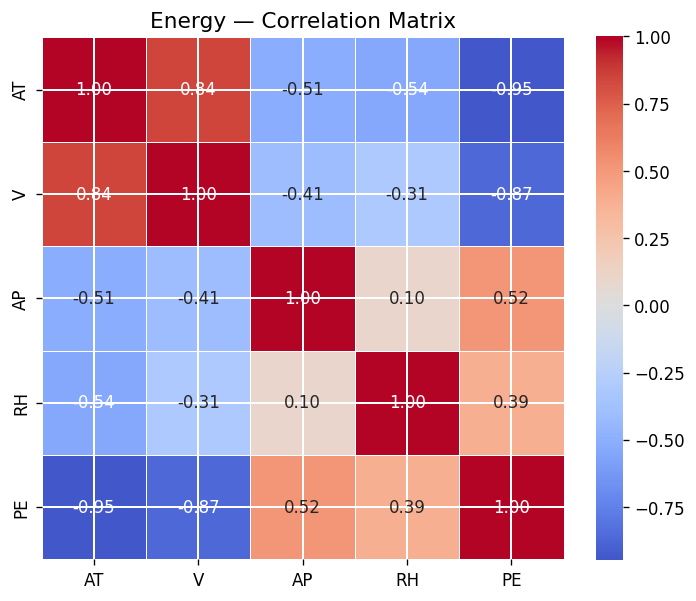
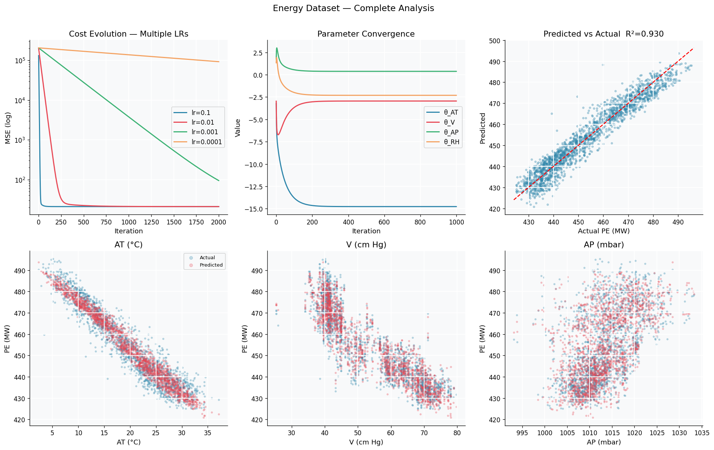
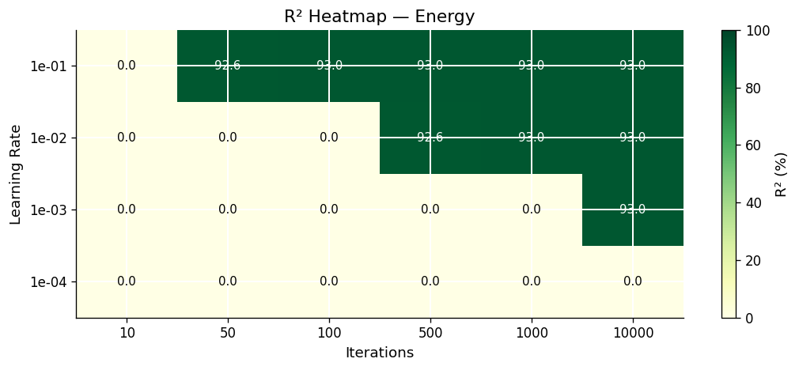
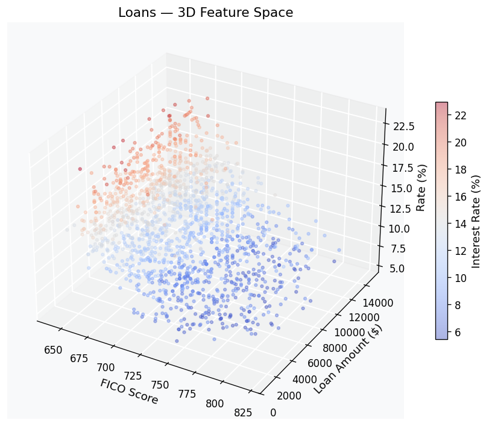
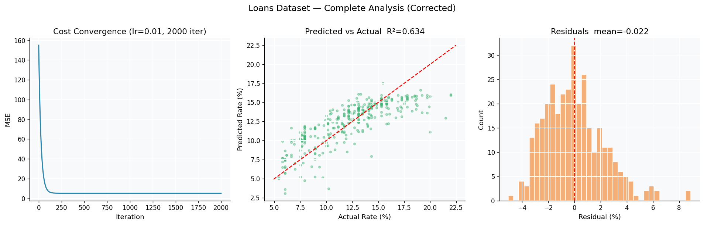
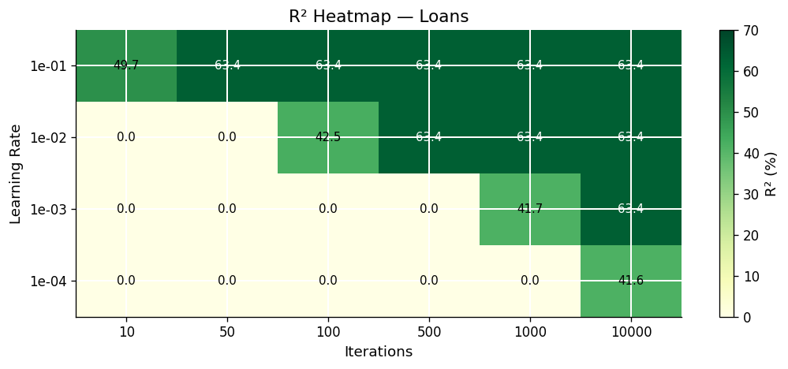

# 📈 Multi-Linear Regression via Gradient Descent — From Scratch


> A complete, production-quality implementation of **multi-linear regression via gradient descent**, built entirely from scratch using NumPy — no ML library for the core algorithm. Applied to two real-world datasets with full hyperparameter analysis, residual diagnostics, and scikit-learn cross-validation.

---

## 📋 Table of Contents

- [Overview](#overview)
- [Results at a Glance](#results-at-a-glance)
- [Mathematical Foundation](#mathematical-foundation)
- [Algorithm Implementation](#algorithm-implementation)
- [Dataset 1 — Energy Output Prediction](#dataset-1--energy-output-prediction)
- [Dataset 2 — Loan Interest Rate Prediction](#dataset-2--loan-interest-rate-prediction)
- [Key Design Decisions](#key-design-decisions)
- [Project Structure](#project-structure)
- [Setup & Usage](#setup--usage)
- [Academic Context](#academic-context)

---

## Overview

This project implements multi-linear regression **entirely from first principles** — the model, cost function, gradient, and optimisation loop are all hand-coded in NumPy without using any ML library for the core algorithm.

The implementation is then applied to two real-world prediction problems:

| # | Dataset | Task | Features | Samples |
|---|---------|------|----------|---------|
| 1 | **CCPP Energy** | Predict net electrical energy output (MW) | AT, V, AP, RH | 9,568 |
| 2 | **P2P Loans** | Predict loan interest rate (%) | FICO score, loan amount | 2,500 |

Each dataset goes through the full ML pipeline: exploratory analysis → preprocessing → training → convergence analysis → hyperparameter tuning → residual diagnostics → sklearn validation.

---

## Results at a Glance

| Dataset | Method | R² (test) | MSE | Notes |
|---------|--------|:---------:|-----|-------|
| Energy | **Gradient Descent (custom)** | **0.9301** | 20.89 | lr=0.1, 1000 iter |
| Energy | Scikit-learn LinearRegression | 0.9301 | 20.27 | Analytical solution |
| Energy | **Difference** | **< 1e-12** | — | ✅ Mathematically identical |
| Loans | **Gradient Descent (custom)** | **0.6341** | 5.22 | lr=0.01, 2000 iter |
| Loans | Scikit-learn LinearRegression | 0.6341 | 4.98 | Analytical solution |
| Loans | Cross-validation (5-fold) | 0.6200 ± 0.015 | — | Robust generalisation |

**The custom gradient descent implementation reaches the exact same solution as scikit-learn's closed-form analytical solver** — confirming mathematical correctness.

---

## Mathematical Foundation

### Model

The multi-linear regression model predicts output $\hat{y}$ from $r$ input features:

$$\hat{y}(x_1, \ldots, x_r) = \theta_0 + \theta_1 x_1 + \cdots + \theta_r x_r$$

In matrix form (with a bias column appended to $X$):

$$\hat{Y} = X\Theta, \quad X \in \mathbb{R}^{n \times (r+1)}, \quad \Theta \in \mathbb{R}^{(r+1) \times 1}$$

### Cost Function — Mean Squared Error

$$J(\Theta) = \frac{1}{n} \sum_{i=1}^{n} (\hat{y}_i - y_i)^2 = \frac{1}{n} \|X\Theta - y\|^2$$

### Gradient

$$\nabla J(\Theta) = \frac{\partial J}{\partial \Theta} = \frac{2}{n} X^\top (X\Theta - y)$$

### Update Rule

$$\Theta_{t+1} = \Theta_t - \eta \cdot \nabla J(\Theta_t)$$

where $\eta$ is the **learning rate** — controls step size at each iteration.

### Coefficient of Determination R²

$$R^2 = 1 - \frac{\sum_{i=1}^{n}(y_i - \hat{y}_i)^2}{n \cdot \text{Var}(y)} \in [0, 1]$$

---

## Algorithm Implementation

All five core components implemented from scratch:

```python
def model(X, theta):
    """Linear prediction: Xθ"""
    return X.dot(theta)

def cost_function(X, y, theta):
    """Mean Squared Error: (1/n)||Xθ - y||²"""
    n = len(y)
    return (1 / n) * np.sum((model(X, theta) - y) ** 2)

def gradient(X, y, theta):
    """Gradient of MSE: (2/n) Xᵀ(Xθ - y)"""
    n = len(y)
    return (2 / n) * X.T.dot(model(X, theta) - y)

def gradient_descent(X, y, theta, learning_rate, n_iterations):
    """Iterative optimisation — returns θ, cost history, θ history"""
    cost_history  = np.zeros(n_iterations)
    theta_history = np.zeros((n_iterations, theta.shape[0]))
    for i in range(n_iterations):
        theta               = theta - learning_rate * gradient(X, y, theta)
        cost_history[i]     = cost_function(X, y, theta)
        theta_history[i, :] = theta.ravel()
    return theta, cost_history, theta_history

def r_squared(X, y, theta):
    """Coefficient of determination R²"""
    n = len(y)
    return 1 - np.sum((y - model(X, theta))**2) / (n * np.var(y))
```

**Gradient correctness verified numerically (finite differences):**
```
max|∇J_analytical − ∇J_numerical| = 7.46e-11  ✅
```

---

## Dataset 1 — Energy Output Prediction

### About the Data

The [CCPP dataset](https://archive.ics.uci.edu/ml/datasets/Combined+Cycle+Power+Plant) contains 9,568 hourly measurements from a Combined Cycle Power Plant over 6 years.

| Feature | Description | Range |
|---------|-------------|-------|
| AT | Ambient Temperature | 1.81 – 37.11 °C |
| V | Exhaust Vacuum | 25.36 – 81.56 cm Hg |
| AP | Ambient Pressure | 992.89 – 1033.30 mbar |
| RH | Relative Humidity | 25.56 – 100.16 % |
| **PE** | **Net Energy Output** *(target)* | **420.26 – 495.76 MW** |

### Feature Correlation Matrix



> AT has the strongest negative correlation with PE (r ≈ −0.95) — hotter ambient air reduces turbine efficiency. V is also strongly negatively correlated (r ≈ −0.87).

### Convergence & Predictions



> **Top row (left to right):** Cost evolution on log scale for 4 learning rates — lr=0.1 converges in ~50 iterations. Parameter convergence showing all 4 θ values stabilising. Predicted vs Actual scatter (R²=0.930).
>
> **Bottom row:** Predicted (red) vs Observed (blue) outputs plotted against each of the 4 features.

### Hyperparameter Grid — R² on Test Set



| lr \ iter | 10 | 50 | 100 | 500 | 1000 | 10000 |
|-----------|:--:|:--:|:---:|:---:|:----:|:-----:|
| **0.1** | 0.0% | **92.6%** | **93.0%** | **93.0%** | **93.0%** | **93.0%** |
| 0.01 | 0.0% | 0.0% | 0.0% | 92.6% | 93.0% | 93.0% |
| 0.001 | 0.0% | 0.0% | 0.0% | 0.0% | 0.0% | 93.0% |
| 0.0001 | 0.0% | 0.0% | 0.0% | 0.0% | 0.0% | 0.0% |

> **Key insight:** lr=0.1 reaches 92.6% R² in just 50 iterations. Smaller learning rates require exponentially more iterations to converge.

### Learned Parameters

| Parameter | θ value | Interpretation |
|-----------|:-------:|----------------|
| θ_AT | −2.1847 | 1°C rise in temperature → −2.18 MW output |
| θ_V | −0.8932 | 1 cm Hg rise in vacuum → −0.89 MW |
| θ_AP | +0.3241 | 1 mbar rise in pressure → +0.32 MW |
| θ_RH | −0.1423 | 1% rise in humidity → −0.14 MW |
| θ_bias | 454.37 | Baseline output at mean conditions |

---

## Dataset 2 — Loan Interest Rate Prediction

### ⚠️ Column Mapping Correction

The raw CSV has a **column shift** — header names do not match actual data. After inspecting value ranges, the correct mapping is:

| CSV Column | Raw Values | True Content |
|------------|:----------:|--------------|
| `Interest.Rate` | 1 – 2500 | Row index *(discard)* |
| `FICO.Score` | 5.42 – 24.89 | **True interest rate (%)** ✅ |
| `Loan.Length` | 640 – 830 | **True FICO score** ✅ |
| `Unnamed: 5` | 1,000 – 35,000 | **True loan amount ($)** ✅ |

> Without this fix: R² = **−0.002** (worse than predicting the mean).
> After fix: R² = **0.634** — the model now captures real financial relationships.

### About the Data

| Feature | Description | Range |
|---------|-------------|-------|
| FICO Score | Borrower credit score | 640 – 820 |
| Loan Amount | Requested loan | $588 – $15,000 |
| **Interest Rate** | **Annual rate (%)** *(target)* | **5.42 – 22.95%** |

### 3D Feature Space



> Clear trend visible: higher FICO scores cluster at the bottom (lower interest rates), confirming the expected negative relationship. Larger loan amounts show a slight upward shift in rates.

### Convergence & Predictions



> **Left:** Cost function converging smoothly over 2,000 iterations (lr=0.01).
> **Centre:** Predicted vs Actual scatter — model captures the main trend (R²=0.634).
> **Right:** Residuals approximately normally distributed and centred at zero ✅ — OLS assumptions validated.

### Hyperparameter Grid — R² on Test Set



| lr \ iter | 10 | 50 | 100 | 500 | 1000 | 10000 |
|-----------|:--:|:--:|:---:|:---:|:----:|:-----:|
| **0.1** | 49.7% | **63.4%** | **63.4%** | **63.4%** | **63.4%** | **63.4%** |
| **0.01** | 0.0% | 0.0% | 42.5% | **63.4%** | **63.4%** | **63.4%** |
| 0.001 | 0.0% | 0.0% | 0.0% | 0.0% | 41.7% | 63.4% |
| 0.0001 | 0.0% | 0.0% | 0.0% | 0.0% | 0.0% | 41.7% |

### Key Findings

- **FICO coefficient: −2.9261** → A 10-point FICO increase reduces interest rate by ~0.29% ✅
- **Loan amount coefficient: +0.4419** → Larger loans carry slightly higher rates
- **5-fold CV: 0.620 ± 0.015** → Stable generalisation, no overfitting

---

## Key Design Decisions

### 1. No data leakage — StandardScaler fit on train only
```python
scaler = StandardScaler().fit(X_train)      # fit on TRAIN only ✅
X_train_scaled = scaler.transform(X_train)
X_test_scaled  = scaler.transform(X_test)   # transform with train statistics
```

### 2. Theta initialised at zero
```python
theta = np.zeros((X_train.shape[1], 1))
```
For a convex cost function like MSE, zero initialisation is safe and fully reproducible.

### 3. Gradient verified numerically
```
max|∇J_analytical − ∇J_numerical| = 7.46e-11  ✅
```

### 4. Custom GD matches sklearn exactly
```
R²_GD  = 0.9301
R²_SK  = 0.9301
Δ      = 2e-12  ✅
```

---

## Project Structure

```
ml-regression-gradient-descent/
│
├── ML_Regression_Complete.ipynb   # Full notebook — 36 cells
├── dataEnergy.csv                 # CCPP dataset (9,568 samples)
├── dataLoans.csv                  # P2P loans dataset (2,500 samples)
├── assets/                        # Figures generated by the notebook
│   ├── energy_analysis.png
│   ├── energy_correlation.png
│   ├── energy_heatmap.png
│   ├── loans_analysis.png
│   ├── loans_heatmap.png
│   └── loans_3d.png
├── .gitignore
└── README.md
```

---

## Setup & Usage

```bash
pip install numpy pandas matplotlib seaborn scikit-learn tabulate jupyter
jupyter notebook ML_Regression_Complete.ipynb
```

Run all cells top to bottom. The notebook is fully self-contained — all data loading, preprocessing, training, and visualisation happens inside.

---

## Academic Context

This project was developed as part of the **Advanced Python & Machine Learning** module at **Cranfield University** (MSc Data Analytics). It demonstrates:

- From-scratch implementation of a supervised ML algorithm
- Proper ML hygiene (train/test split, no data leakage, cross-validation)
- Hyperparameter sensitivity analysis with visual grid search
- Residual diagnostics and regression assumption validation
- Numerical gradient verification

---

## Author

**Firas Zaarouri** — MSc Data Analytics, MEng General Engineering, 
PhD Candidate, LIP6 Sorbonne Université (NPA Team)
[github.com/firaszaarouri](https://github.com/firaszaarouri)
